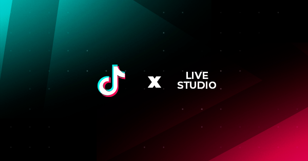

<!-- PROJECT LOGO -->
 

  

  
[![Forks][forks-shield]][forks-url]
[![Stargazers][stars-shield]][stars-url]
[![Issues][issues-shield]][issues-url]
[![MIT License][license-shield]][license-url]
[![LinkedIn][linkedin-shield]][linkedin-url]

  <h3 align="center">TikTok Live Studio Optimizer</h3>

  

    An application to optimize your TikTok Live Studio experience.
     
    ·
    <a href="https://github.com/luke-beep/tiktok-live-studio-optimizer/issues">Report Bug</a>
    ·
    <a href="https://github.com/luke-beep/tiktok-live-studio-optimizer/issues">Request Feature</a>
  

<!-- TABLE OF CONTENTS -->

  
Table of Contents

  <ol>
    <li>
      <a href="#about-the-project">About The Project</a>
      <ul>
        <li><a href="#built-with">Built With</a></li>
      </ul>
    </li>
    <li>
      <a href="#getting-started">Getting Started</a>
      <ul>
        <li><a href="#prerequisites">Prerequisites</a></li>
        <li><a href="#installation">Installation</a></li>
      </ul>
    </li>
    <li><a href="#usage">Usage</a></li>
    <li><a href="#roadmap">Roadmap</a></li>
    <li><a href="#contributing">Contributing</a></li>
    <li><a href="#license">License</a></li>
    <li><a href="#contact">Contact</a></li>
    <li><a href="#acknowledgments">Acknowledgments</a></li>
  </ol>

<!-- ABOUT THE PROJECT -->
## About The Project

[![Product Name Screen Shot][product-screenshot]](https://lukehjo.rocks)

When using TikTok Live Studio, you may notice that your computer is very slow and laggy. This is because TikTok Live Studio is a resource hog. This application will optimize your experience by deleting all the unnecessary files that TikTok Live Studio creates. This application can run in the background without taking up any resources.

Why is this necessary? TikTok Live Studio creates a lot of files that are not needed. These files are created every time you start a live stream. This application will delete these files so that your computer can run faster and smoother.

These files are debug logs that get created every time you start a live stream. They are not needed and can be deleted. They are located in AppData\Local\TikTok LIVE Studio\watchdog. These files are probably just a mistake made by the developers of the TikTok LIVE Studio application.

(<a href="#readme-top">back to top</a>)

### Built With

TikTok LIVE Studio Optimizer is built with the following technologies:

* [![C#][CSharp]][CSharp-url]
* [![.NET][Dotnet]][Dotnet-url]

(<a href="#readme-top">back to top</a>)

<!-- GETTING STARTED -->
## Getting Started

This is an example of how you may give instructions on setting up your project locally.
To get a local copy up and running follow these simple example steps.

### Prerequisites

Install .NET 6.0
Install Visual Studio 2022

### Installation

1. Go to the release tab and download the latest release https://github.com/luke-beep/tiktok-live-studio-optimizer/releases/tag/beta
2. Unzip the file and run the TikTok Live Studio Optimizer.exe file or build it yourself. 
3. You can build it yourself by opening the TikTok Live Studio Optimizer.sln file in Visual Studio 2022 and building it.

(<a href="#readme-top">back to top</a>)

<!-- USAGE EXAMPLES -->
## Usage

This application automatically cleans and optimizes your TikTok Live Studio experience. It will delete all the unnecessary files that TikTok Live Studio creates in the watchdog folder. This application can run in the background without taking up any resources.

(<a href="#readme-top">back to top</a>)

<!-- ROADMAP -->
## Roadmap

- [x] Add Changelog
- [ ] Add "How to Contribute" section
- [ ] Add a settings configuration file

See the [open issues](https://github.com/luke-beep/tiktok-live-studio-optimizer/issues) for a full list of proposed features (and known issues).

(<a href="#readme-top">back to top</a>)

<!-- CONTRIBUTING -->
## Contributing

Contributions are what make the open source community such an amazing place to learn, inspire, and create. Any contributions you make are **greatly appreciated**.

If you have a suggestion that would make this better, please fork the repo and create a pull request. You can also simply open an issue with the tag "enhancement".
Don't forget to give the project a star! Thanks again!

1. Fork the Project
2. Create your Feature Branch (`git checkout -b feature/AmazingFeature`)
3. Commit your Changes (`git commit -m 'Add some AmazingFeature'`)
4. Push to the Branch (`git push origin feature/AmazingFeature`)
5. Open a Pull Request

(<a href="#readme-top">back to top</a>)

<!-- LICENSE -->
## License

Distributed under the MIT License. See [LICENSE.txt](https://github.com/luke-beep/tiktok-live-studio-optimizer/blob/master/static/LICENSE.txt) for more information.

(<a href="#readme-top">back to top</a>)

<!-- CONTACT -->
## Contact

Your Name - [@LuckyLukeHjo](https://twitter.com/LuckyLukeHjo) - lukehjo@gmail.com

Project Link: [https://github.com/luke-beep/tiktok-live-studio-optimizer](https://github.com/luke-beep/tiktok-live-studio-optimizer)

(<a href="#readme-top">back to top</a>)

<!-- ACKNOWLEDGMENTS -->
## Acknowledgments

* [Best-README-Template](https://github.com/othneildrew/Best-README-Template)

(<a href="#readme-top">back to top</a>)

<a name="footer">1></a>: LukeHjo 2023

<!-- MARKDOWN LINKS & IMAGES -->
<!-- https://www.markdownguide.org/basic-syntax/#reference-style-links -->
[contributors-shield]: https://img.shields.io/github/contributors/luke-beep/tiktok-live-studio-optimizer.svg?style=for-the-badge
[contributors-url]: https://github.com/luke-beep/tiktok-live-studio-optimizer/graphs/contributors
[forks-shield]: https://img.shields.io/github/forks/luke-beep/tiktok-live-studio-optimizer.svg?style=for-the-badge
[forks-url]: https://github.com/luke-beep/tiktok-live-studio-optimizer/network/members
[stars-shield]: https://img.shields.io/github/stars/luke-beep/tiktok-live-studio-optimizer.svg?style=for-the-badge
[stars-url]: https://github.com/luke-beep/tiktok-live-studio-optimizer/stargazers
[issues-shield]: https://img.shields.io/github/issues/luke-beep/tiktok-live-studio-optimizer.svg?style=for-the-badge
[issues-url]: https://github.com/luke-beep/tiktok-live-studio-optimizer/issues
[license-shield]: https://img.shields.io/github/license/luke-beep/tiktok-live-studio-optimizer.svg?style=for-the-badge
[license-url]: https://github.com/luke-beep/tiktok-live-studio-optimizer/blob/master/static/LICENSE.txt
[linkedin-shield]: https://img.shields.io/badge/-LinkedIn-black.svg?style=for-the-badge&logo=linkedin&colorB=555
[linkedin-url]: https://www.linkedin.com/in/luke-hjo-68037a257/
[product-screenshot]: static/screenshot.png
[CSharp]: https://img.shields.io/badge/C%23-239120?style=for-the-badge&logo=c-sharp&logoColor=white
[CSharp-url]: https://docs.microsoft.com/en-us/dotnet/csharp/
[Dotnet-url]: https://docs.microsoft.com/en-us/dotnet/
[Dotnet]: https://img.shields.io/badge/.dotnet-239120?style=for-the-badge&logo=c-sharp&logoColor=white

<!-- 
* [Choose an Open Source License](https://choosealicense.com)
* [GitHub Emoji Cheat Sheet](https://www.webpagefx.com/tools/emoji-cheat-sheet)
* [Malven's Flexbox Cheatsheet](https://flexbox.malven.co/)
* [Malven's Grid Cheatsheet](https://grid.malven.co/)
* [Img Shields](https://shields.io)
* [GitHub Pages](https://pages.github.com)
* [Font Awesome](https://fontawesome.com)
* [React Icons](https://react-icons.github.io/react-icons/search) 
-->
